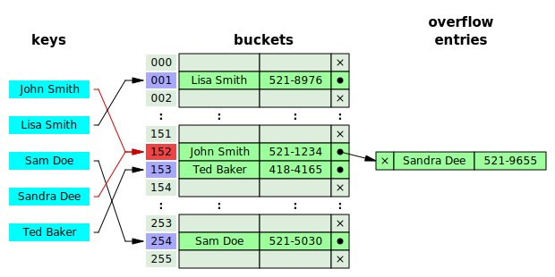

# Hash Table

In computer science, a **Hash Table** is a Hash Implementation of a **Dictionary** which implements an associative array abstract data type, a structure that can map keys to values. A hash table uses a **hash function** to compute an index into an array of buckets or slots, from which the desired value can be found

Ideally, the hash function will assign each key to a unique bucket, but most hash table designs employ an imperfect hash function, which might cause **hash collisions** where the hash function generates the same index for more than one key. Such collisions must be accommodated in one of two ways.

**Separate chaining** consists of creating a linked list for each position of the table and storing the elements in it it. This is by far the simplest solution however requires additional memory outside of the hash table instance.

**Linear Probing** consists of checking if the index is already occupied and then attempting to insert at the following index **index + 1** and continuing to check at the following index until an available index is found.

## Example

Hash collision resolved by separate chaining

