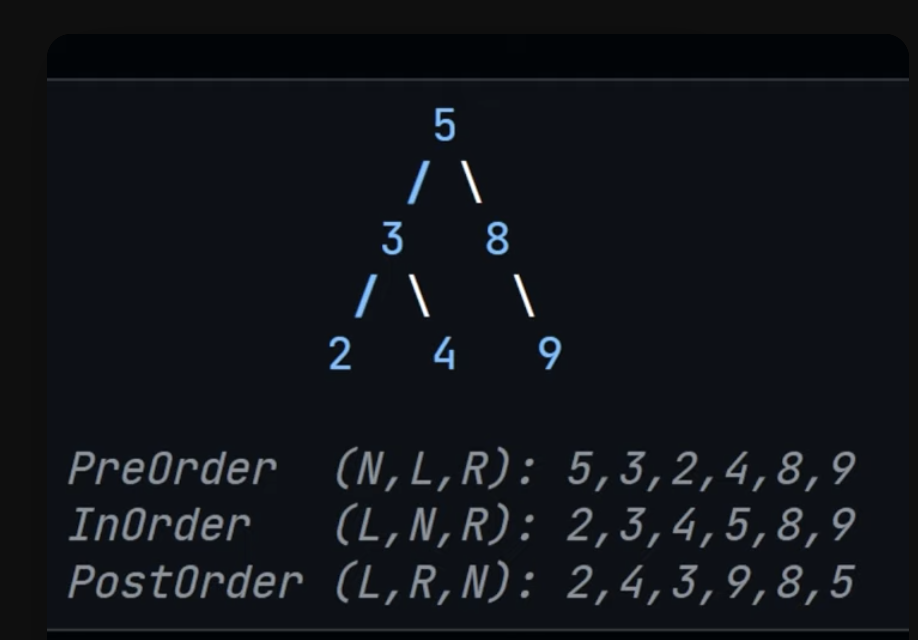

# Tree Traversal

## Concepts

### Call Stack

Summary
Left-first Strategy: The recursive calls always explore the left child first.

Null Check: Once a null (leaf node) is hit, the function returns.

Backtracking: The function returns to the previous call to process the right child after all left children are processed.

Call Stack Management: The call stack grows as it explores down the left subtree and shrinks as it backtracks, handling right children after left children are fully processed.

### Depth First Search

DFS explores as far down a branch as possible before backtracking. It has three primary varieties:

PreOrder Traversal: Visit the root node first, then recursively visit the left subtree, followed by the right subtree.

Order: Root -> Left -> Right
Example: For a tree with root A, left child B, and right child C, the PreOrder traversal would be A B C.

InOrder Traversal: Recursively visit the left subtree first, then visit the root node, and finally the right subtree.

Order: Left -> Root -> Right
Example: For the same tree, the InOrder traversal would be B A C.

PostOrder Traversal: Recursively visit the left subtree first, then the right subtree, and finally the root node.

Order: Left -> Right -> Root
Example: For the same tree, the PostOrder traversal would be B C A.

Depth First Search has 3 approaches

1. PreOrder
2. InOrder
3. PostOrder

### Breadth First Search

BFS explores all nodes at the present depth level before moving on to nodes at the next depth level. BFS is typically implemented using a queue.

Level Order Traversal: Visit nodes level by level from top to bottom and from left to right within each level.
Example: For a tree with root A, left child B, and right child C, the Level Order traversal would be A B C.

### Depth First Search Vs Breadth First Search

#### Key Differences

DFS: Explores deeper nodes first before backtracking. Different varieties (PreOrder, InOrder, PostOrder) depend on the order of visiting nodes.

BFS: Explores all nodes at the present depth level before moving on to the next depth level. It does not have varieties akin to DFS but is often represented by Level Order traversal.

In the image example

- BFS would be : 5, 3, 8, 2, 4, 9
- DFS Pre-Order would be 5, 3, 2, 4, 8, 9
